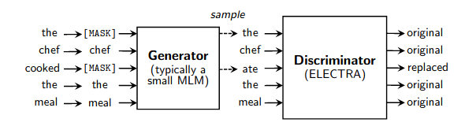

</img>

## Electra - Pytorch

A simple working wrapper for fast pretraining of language models as detailed in <a href="https://arxiv.org/abs/2003.10555">this paper</a>. It speeds up training (in comparison to normal masked language modeling) by a factor of 4x, and eventually reaches better performance if trained for even longer. Special thanks to <a href="https://github.com/enijkamp">Erik Nijkamp</a> for taking the time to replicate the results for GLUE.

## Install

```bash
$ pip install electra-pytorch
```

## Usage

The following example uses `reformer-pytorch`, which is available to be pip installed.

```python
import torch
from torch import nn
from reformer_pytorch import ReformerLM

from electra_pytorch import Electra

# (1) instantiate the generator and discriminator, making sure that the generator is roughly a quarter to a half of the size of the discriminator

generator = ReformerLM(
    num_tokens = 20000,
    emb_dim = 128,
    dim = 256,              # smaller hidden dimension
    heads = 4,              # less heads
    ff_mult = 2,            # smaller feed forward intermediate dimension
    dim_head = 64,
    depth = 12,
    max_seq_len = 1024
)

discriminator = ReformerLM(
    num_tokens = 20000,
    emb_dim = 128,
    dim = 1024,
    dim_head = 64,
    heads = 16,
    depth = 12,
    ff_mult = 4,
    max_seq_len = 1024
)

# (2) weight tie the token and positional embeddings of generator and discriminator

generator.token_emb = discriminator.token_emb
generator.pos_emb = discriminator.pos_emb
# weight tie any other embeddings if available, token type embeddings, etc.

# (3) instantiate electra

trainer = Electra(
    generator,
    discriminator,
    discr_dim = 1024,           # the embedding dimension of the discriminator
    discr_layer = 'reformer',   # the layer name in the discriminator, whose output would be used for predicting token is still the same or replaced
    mask_token_id = 2,          # the token id reserved for masking
    pad_token_id = 0,           # the token id for padding
    mask_prob = 0.15,           # masking probability for masked language modeling
    mask_ignore_token_ids = []  # ids of tokens to ignore for mask modeling ex. (cls, sep)
)

# (4) train

data = torch.randint(0, 20000, (1, 1024))

results = trainer(data)
results.loss.backward()

# after much training, the discriminator should have improved

torch.save(discriminator, f'./pretrained-model.pt')
```

If you would rather not have the framework auto-magically intercept the hidden output of the discriminator, you can pass in the discriminator (with the extra linear [dim x 1]) by yourself with the following.

```python
import torch
from torch import nn
from reformer_pytorch import ReformerLM

from electra_pytorch import Electra

# (1) instantiate the generator and discriminator, making sure that the generator is roughly a quarter to a half of the size of the discriminator

generator = ReformerLM(
    num_tokens = 20000,
    emb_dim = 128,
    dim = 256,              # smaller hidden dimension
    heads = 4,              # less heads
    ff_mult = 2,            # smaller feed forward intermediate dimension
    dim_head = 64,
    depth = 12,
    max_seq_len = 1024
)

discriminator = ReformerLM(
    num_tokens = 20000,
    emb_dim = 128,
    dim = 1024,
    dim_head = 64,
    heads = 16,
    depth = 12,
    ff_mult = 4,
    max_seq_len = 1024,
    return_embeddings = True
)

# (2) weight tie the token and positional embeddings of generator and discriminator

generator.token_emb = discriminator.token_emb
generator.pos_emb = discriminator.pos_emb
# weight tie any other embeddings if available, token type embeddings, etc.

# (3) instantiate electra

discriminator_with_adapter = nn.Sequential(discriminator, nn.Linear(1024, 1))

trainer = Electra(
    generator,
    discriminator_with_adapter,
    mask_token_id = 2,          # the token id reserved for masking
    pad_token_id = 0,           # the token id for padding
    mask_prob = 0.15,           # masking probability for masked language modeling
    mask_ignore_token_ids = []  # ids of tokens to ignore for mask modeling ex. (cls, sep)
)

# (4) train

data = torch.randint(0, 20000, (1, 1024))

results = trainer(data)
results.loss.backward()

# after much training, the discriminator should have improved

torch.save(discriminator, f'./pretrained-model.pt')
```

## Important details for successful training

The generator should be roughly a quarter to at most one half of the discriminator's size for effective training. Any greater and the generator will be too good and the adversarial game collapses. This was done by reducing the hidden dimension, feed forward hidden dimension, and number of attention heads in the paper.

## Testing

```bash
$ python setup.py test
```

## Training

1. Download the [OpenWebText](https://github.com/jcpeterson/openwebtext) dataset.

```bash
$ mkdir data
$ cd data
$ pip3 install gdown
$ gdown --id 1EA5V0oetDCOke7afsktL_JDQ-ETtNOvx
$ tar -xf openwebtext.tar.xz
$ wget https://storage.googleapis.com/electra-data/vocab.txt
$ cd ..
```

2. Tokenize dataset.

```bash
$ python pretraining/openwebtext/preprocess.py
```

3. Pre-train.

```bash
$ python pretraining/openwebtext/pretrain.py
```

4. Download GLUE dataset.

```bash
$ python examples/glue/download.py 
```

5. Fine-tune on the MRPC sub-task of the GLUE benchmark.

```bash
$ python examples/glue/run.py --model_name_or_path output/yyyy-mm-dd-hh-mm-ss/ckpt/200000
```

## Citations

```bibtex
@misc{clark2020electra,
    title={ELECTRA: Pre-training Text Encoders as Discriminators Rather Than Generators},
    author={Kevin Clark and Minh-Thang Luong and Quoc V. Le and Christopher D. Manning},
    year={2020},
    eprint={2003.10555},
    archivePrefix={arXiv},
    primaryClass={cs.CL}
}
```
